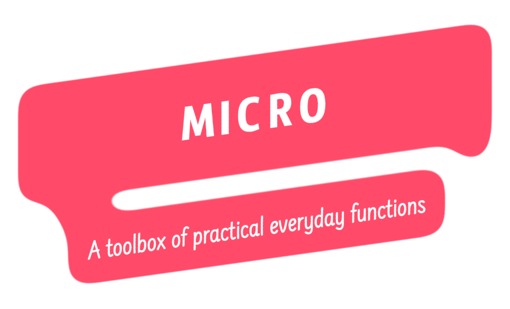

  

  
  
  

  

## Description

Micro is a collection of individually packaged helpers, functional blocks, and general knick-knacks that often get repeated between projects.

## License

This project is released under the [MIT License](./LICENSE). Enjoy responsibly ✌️
